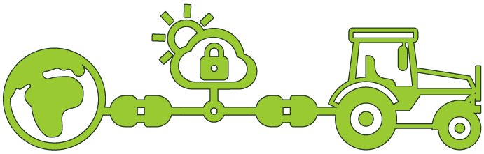
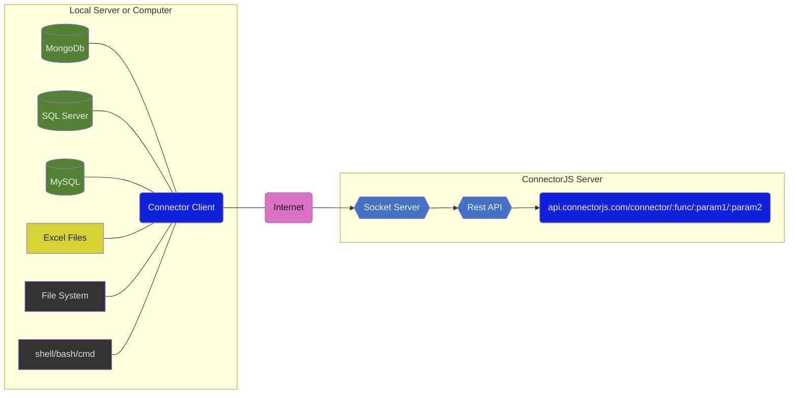

  

<a href="https://connectorjs.com" _target="blank">
  <h1 align="center">CONNECTORJS.com</h1>
</a>

 

## About

ConnectorJS developed by [MiaJupiter](https://miajupiter.com)

## Our mottos

- Simplicity is a form of high intelligence.
- Think & work for all mankind.

## Ideas we support

- Knowledge belongs to all beings, even to humanity.
- Open source softwares

## Structure

